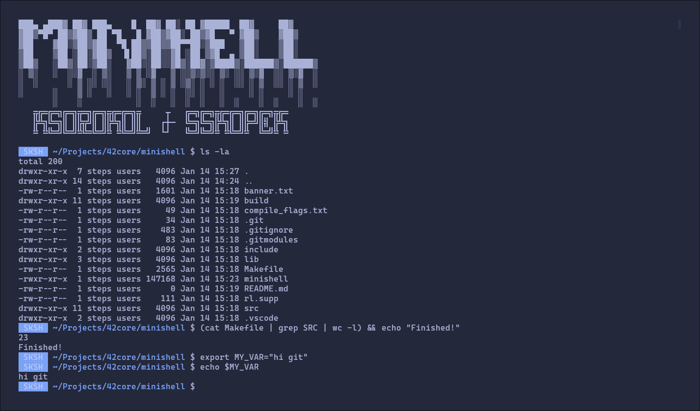

# Minishell
Minimal implementation of the UNIX shell, inspired by Bash



## Build
Pull submodules and run make


```bash
git submodule init
gti submodule update
make
```
## Usage
Execute the binary
```bash
./minishell
```

## Features
- set of builtins like `echo`, `export`, `unset`, `pwd`, `cd`, `env` (without options besides `-n` for `echo`)
- pipes and redirections, including here-document
- `&&` and `||` with `()` for priorities (Only pipes and redirection won't work for whole groups)
- `*` wildcard expansion
